# Tax Auditing Database System

## Project Members
- Thomas Yang
- Kyan Tan

## Project Description
This project is a Tax Auditing Database System built in Java. The purpose of the program is to help users manage taxpayer records and perform audit checks through a menu driven system.

The system uses classes such as `Taxpayer`, `TaxRecord`, and `AuditLog` to organize the information. Instead of using a real database, the program stores the records using `ArrayList`s. The project also uses object oriented programming concepts to keep the program clean, organized, and easier to understand.

## YouTube Video Link
Paste your YouTube presentation link here

## UML Diagram


## User Guide

### How to Run the Program
1. Download the Java files from this GitHub repository.
2. Open the files in a Java such as Eclipse or VS Code.
3. Run the `TaxAuditSystem.java` file.
4. Follow the menu options shown in the console.

### How to Compile and Run in Terminal
```bash
javac TaxAuditSystem.java Taxpayer.java TaxRecord.java AuditLog.java
java TaxAuditSystem
