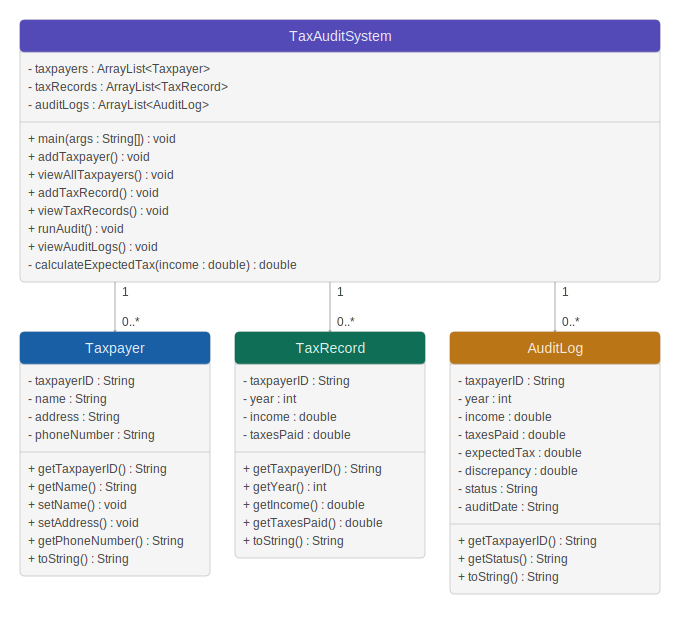
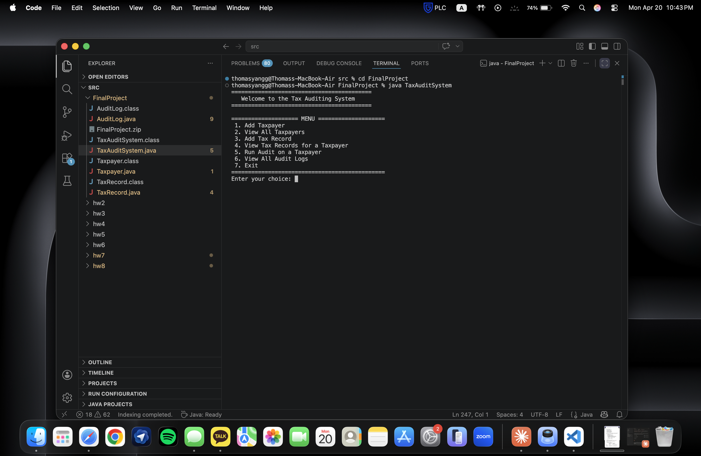
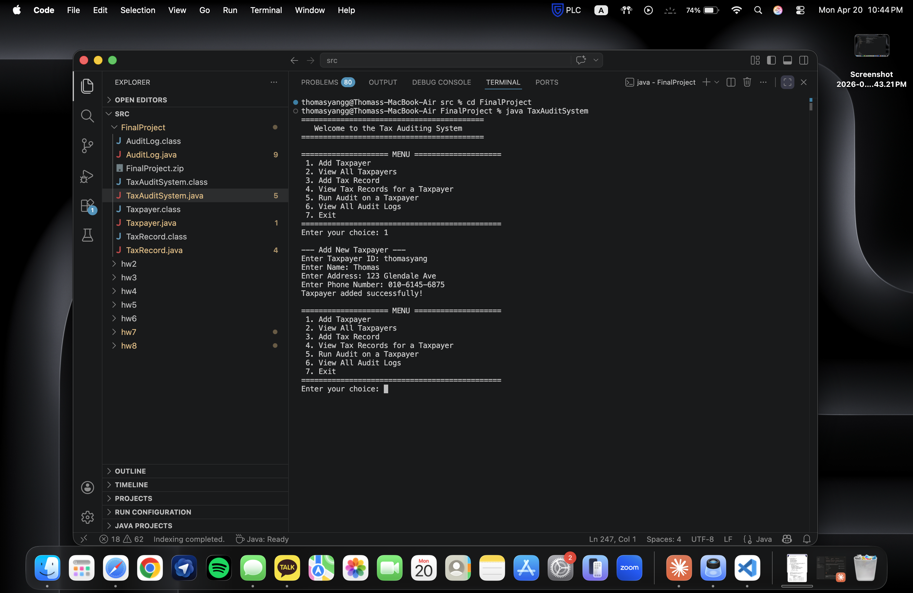
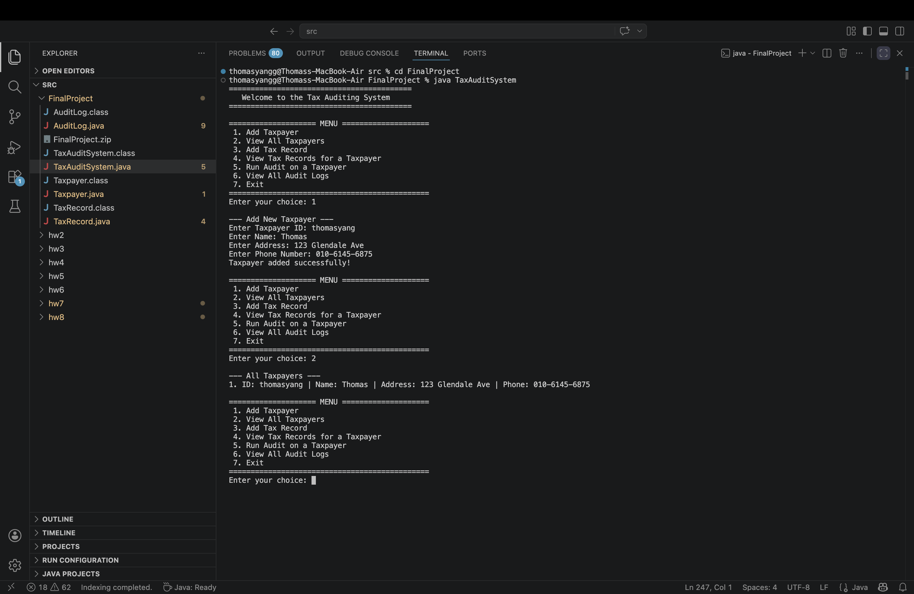
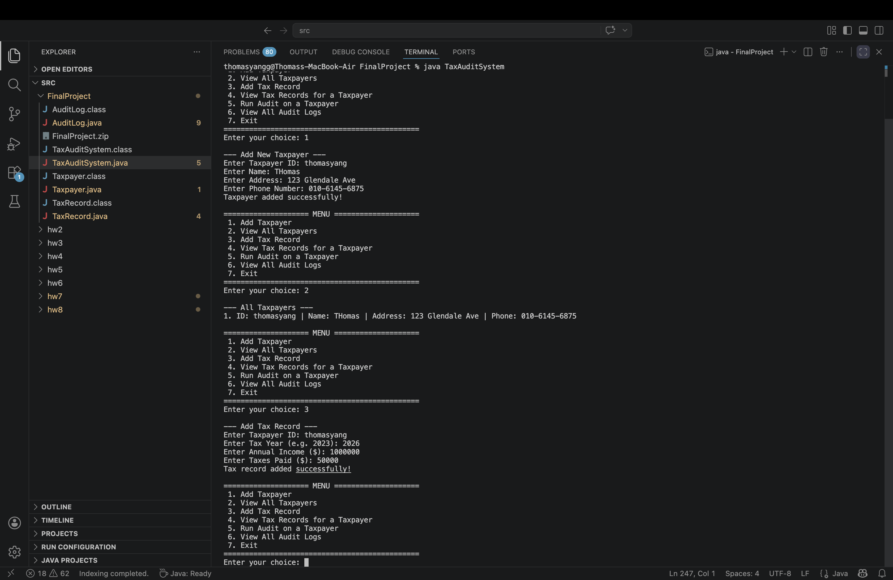
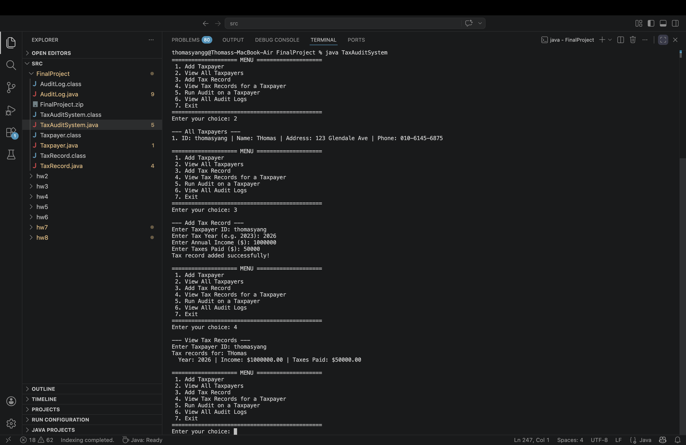
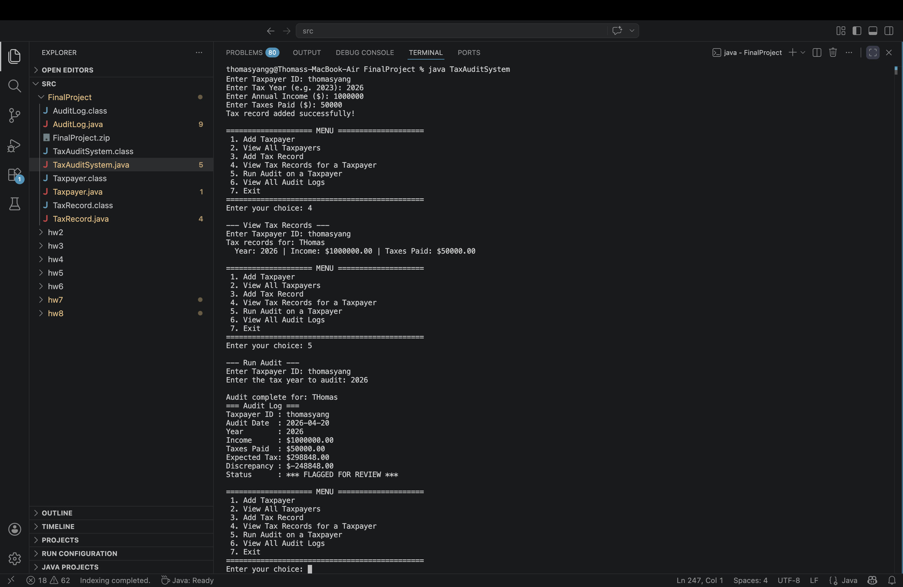
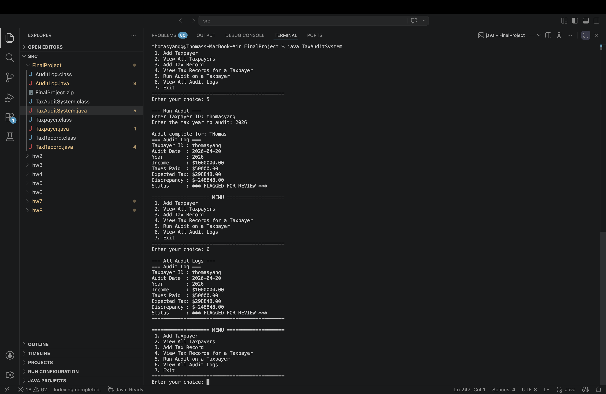
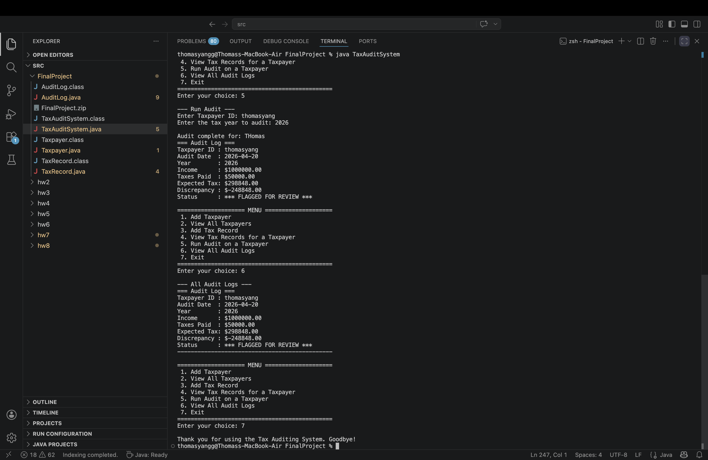

# Tax Auditing Database System

## Project Members
- Thomas Yang
- Kyan Tan

## Project Description
This project is a Tax Auditing Database System built in Java. The purpose of the program is to help users manage taxpayer records and perform audit checks through a menu driven system.

The system uses classes such as `Taxpayer`, `TaxRecord`, and `AuditLog` to organize the information. Instead of using a real database, the program stores the records using `ArrayList`s. The project also uses object oriented programming concepts to keep the program clean, organized, and easier to understand.

## YouTube Video Link
Paste your YouTube presentation link here

## UML Diagram


## User Guide

### How to Run the Program
1. Download the Java files from this GitHub repository.
2. Open the files in a Java such as Eclipse or VS Code.
3. Run the `TaxAuditSystem.java` file.
4. Follow the menu options shown in the console.

### How to Compile and Run in Terminal 
```bash
javac TaxAuditSystem.java Taxpayer.java TaxRecord.java AuditLog.java
java TaxAuditSystem
```
### Program Features: 
- Add a taxpayer
- View all taxpayers
- Add a tax record
- View tax records for a taxpayer
- Run an audit on a taxpayer
- View all audit logs

## Screenshots of Program Execution with Explanation

### 1. Main Menu

This screenshot shows the welcome screen and the main menu of the program. The user can choose from different options to manage taxpayer records and perform audit related tasks.

### 2. Add Taxpayer

This screenshot shows the user entering a new taxpayer's information, including the taxpayer ID, name, address, and phone number. After the information is entered, the taxpayer is added to the system.

### 3. View All Taxpayers

This screenshot shows the list of all taxpayers currently stored in the system. It allows the user to confirm that the taxpayer information was saved correctly.

### 4. Add Tax Record

This screenshot shows the process of adding a tax record for a taxpayer. The user enters the taxpayer ID, tax year, annual income, and taxes paid.

### 5. View Tax Records

This screenshot shows the tax records that belong to a specific taxpayer. It helps the user check stored financial information for that person.

### 6. Run Audit

This screenshot shows the audit feature of the program. The system checks the selected taxpayer’s tax record and calculates the expected tax amount based on the stored income.

### 7. View Audit Logs

This screenshot shows the audit logs created by the program. It allows the user to review the details of completed audits.

### 8. Exit Message

This screenshot shows the exit message it give you when the program closes out.

## Concepts Used
- Classes and objects
- ArrayLists
- Menu driven interaction
- Exception handling
- Inheritance or object oriented design
